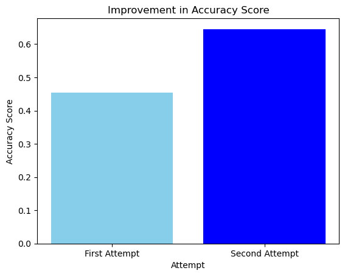
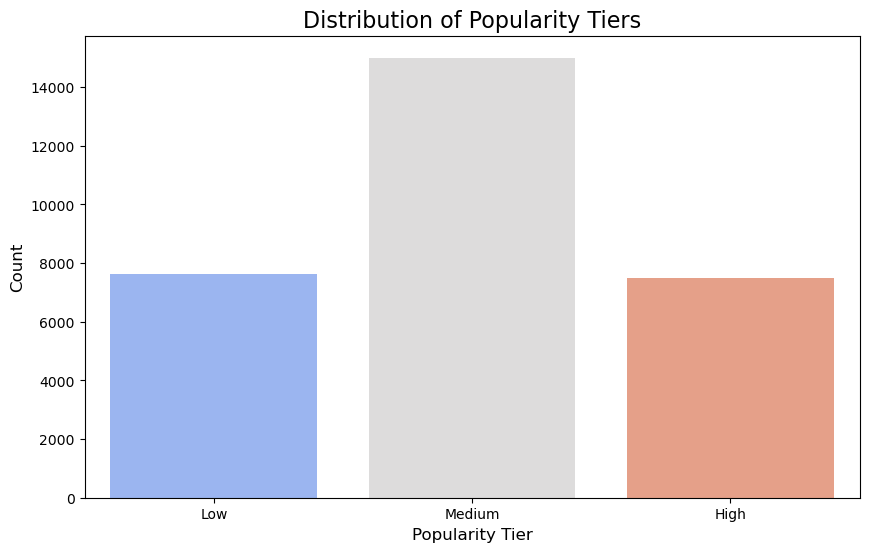
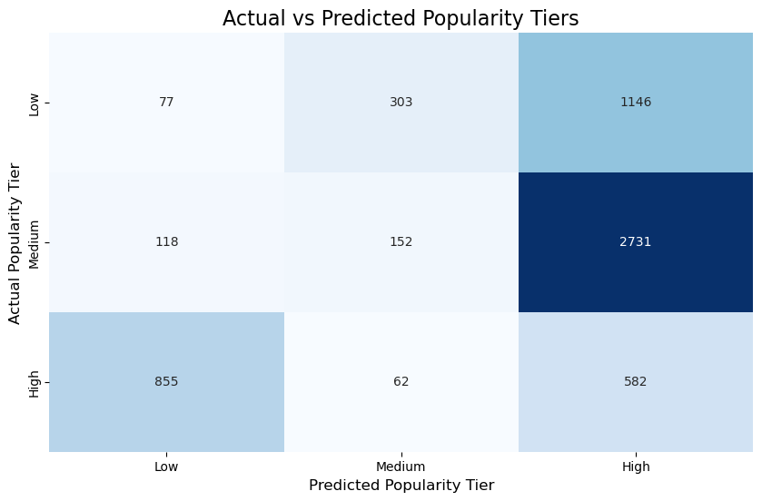
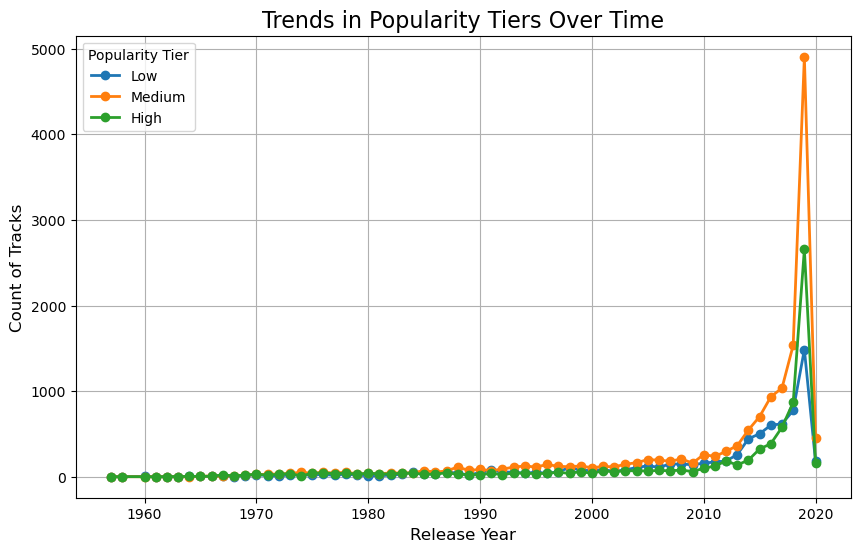
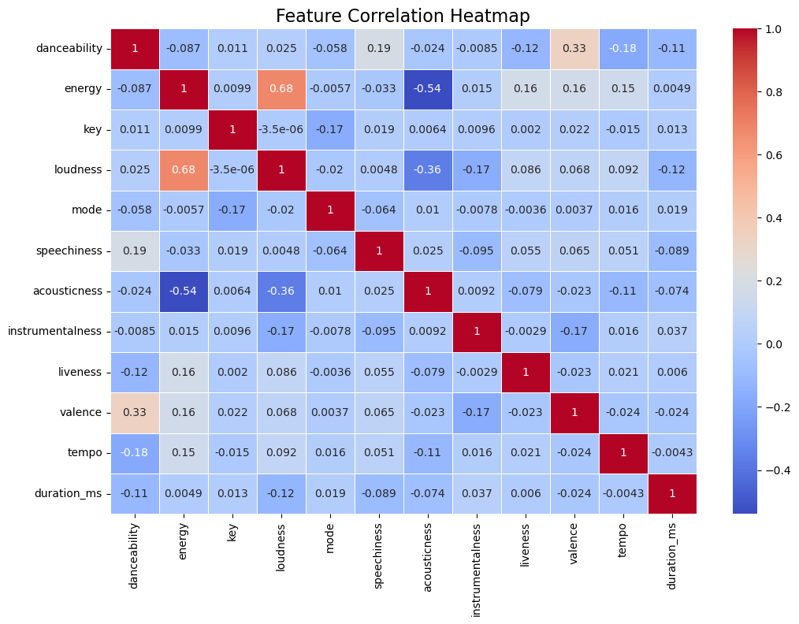
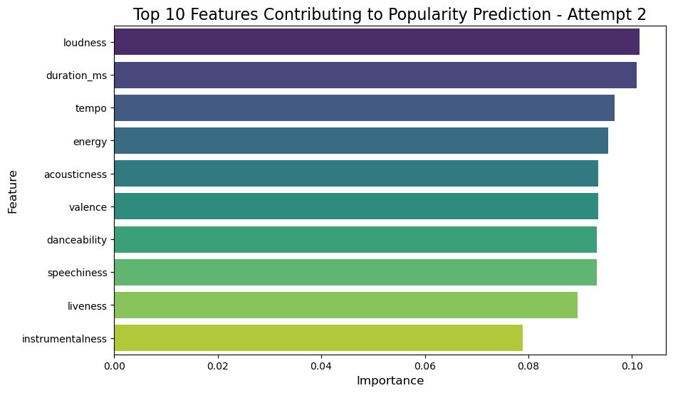

# Predicting Popularity of Spotify Music Tracks

## Table of Contents

[Overview](#overview)

[Instructions](#instructions)

[Data](#data)

[Analysis](#analysis)

[Conclusion](#conclusion)

[Presentation](#presentation)

[The Team](#the-team)

## Project Overview

### Overview

This project aims to predict the popularity of Spotify music tracks based on a song's features recorded on the Spotify API. These features include danceability, energy, key, loudness, speechiness, acousticness, instrumentalness, liveness, valence, tempo and duration. Specifically, we looked at how the differnet features impact a song's popularity as measured by Spotify.

#### Questions we aim to answer

1. Is there a correlation between a song's features and it's popularity?
2. What feature has the highest importance in a song's popularity?
3. How accurately can a song's popularity be predicted based on its features?

### Instructions

#### Execution

1. Ensure that the dependencies are installed to successfully import the below:
    
    import pandas as pd  
    import matplotlib.pyplot as plt  
    import seaborn as sns  
    import numpy as np  
    from sklearn.preprocessing import StandardScaler, LabelEncoder  
    from sklearn.model_selection import train_test_split, GridSearchCV  
    from sklearn.metrics import accuracy_score, classification_report, confusion_matrix  
    from sklearn.neighbors import KNeighborsClassifier  
    from sklearn.ensemble import RandomForestClassifier, GradientBoostingClassifier  
    from sklearn.linear_model import LogisticRegression  
    

1. Open and run [combined_analysis.ipynb](combined_analysis.ipynb) in a Jupyter Notebook or Jupyter Lab.

#### High-level logic contained in combined_analysis.ipynb:

[combined_analysis.ipynb](combined_analysis.ipynb) is the main notebook for training and testing data, and predicting results.

1. Read the following CSV files from [./Resources](./Resources/):

        spotify_songs

2.a Data cleaning - First attempt

        Drop rows with duplicate track_id and track-name.

        Drop rows with missing or zero track_popularity.
   
        Drop columns that will not be used in analyzing the data:
            track_id
            track_album_release_date
            playlist_genre
            track_name
            track_artist
            track_album_id
            playlist_subgenre
            track_album_name
            playlist_name
            playlist_id
            mode
            
        Divide track-popularity into 3 tiers:
            0 ~ 31  : Not Popular
            32 ~ 48 : Neutral
            49 ~ 63 : Popular
            64 ~ 100: Very Popular

        Split data into train and test

        Encode and scale 'key' column

2.b Data cleaning - Second attempt
        
        Drop rows with duplicate track_id and track-name.

        Drop rows with missing or zero track_popularity.
   
        Drop columns that will not be used in analyzing the data:
            track_id
            track_album_release_date
            playlist_genre
            track_name
            track_artist
            track_album_id
            playlist_subgenre
            track_album_name
            playlist_name
            playlist_id
         
        Normalize numerical columns
        
        Divide track-popularity into 3 tiers:
            0 ~ 31  : Low
            32 ~ 63 : Medium
            64 ~ 100: Highr

        Split data into train and test
          
3.a Modeling - First attempt

        Apply and evaluate accuracy of various prediction models
            K Neighbors Classifier
            Logstic Regression
            Random Forest Classifier

3.b Modeling - Second attempt

        Apply and evaluate accuracy of various prediction models
            Gradient Boosting Classifier
            Logstic Regression
            Random Forest Classifier with Grid
            
4.  Predict popularity of a new track by providing values for:  
            danceability  
            energy  
            key  
            loudness  
            speechiness  
            acousticness  
            instrumentalness  
            liveness  
            valence  
            tempo  
            duration_ms  

### Data
Data Source:  
    Spotify Songs - [Kaggle](https://www.kaggle.com/datasets/joebeachcapital/30000-spotify-songs/)

Data Dictionary
|variable                 |class     |description |
|:---|:---|:-----------|
|track_id                 |character | Song unique ID|
|track_name               |character | Song Name|
|track_artist             |character | Song Artist|
|track_popularity         |double    | Song Popularity (0-100) where higher is better. The popularity is calculated by algorithm and is based mainly on the total number of plays the track has had and how recent those plays are. |
|track_album_id           |character | Album unique ID|
|track_album_name         |character | Song album name |
|track_album_release_date |character | Date when album released |
|playlist_name            |character | Name of playlist |
|playlist_id              |character | Playlist ID|
|playlist_genre           |character | Playlist genre |
|playlist_subgenre        |character | Playlist subgenre|
|danceability             |double    | Danceability describes how suitable a track is for dancing based on a combination of musical elements including tempo, rhythm stability, beat strength, and overall regularity. A value of 0.0 is least danceable and 1.0 is most danceable. |
|energy                   |double    | Energy is a measure from 0.0 to 1.0 and represents a perceptual measure of intensity and activity. Typically, energetic tracks feel fast, loud, and noisy. For example, death metal has high energy, while a Bach prelude scores low on the scale. Perceptual features contributing to this attribute include dynamic range, perceived loudness, timbre, onset rate, and general entropy. |
|key                      |double    | The estimated overall key of the track. Integers map to pitches using standard Pitch Class notation . E.g. 0 = C, 1 = C♯/D♭, 2 = D, and so on. If no key was detected, the value is -1. |
|loudness                 |double    | The overall loudness of a track in decibels (dB). Loudness values are averaged across the entire track and are useful for comparing relative loudness of tracks. Loudness is the quality of a sound that is the primary psychological correlate of physical strength (amplitude). Values typical range between -60 and 0 db.|
|mode                     |double    | Mode indicates the modality (major or minor) of a track, the type of scale from which its melodic content is derived. Major is represented by 1 and minor is 0.|
|speechiness              |double    | Speechiness detects the presence of spoken words in a track. The more exclusively speech-like the recording (e.g. talk show, audio book, poetry), the closer to 1.0 the attribute value. Values above 0.66 describe tracks that are probably made entirely of spoken words. Values between 0.33 and 0.66 describe tracks that may contain both music and speech, either in sections or layered, including such cases as rap music. Values below 0.33 most likely represent music and other non-speech-like tracks. |
|acousticness             |double    | A confidence measure from 0.0 to 1.0 of whether the track is acoustic. 1.0 represents high confidence the track is acoustic.|
|instrumentalness         |double    | Predicts whether a track contains no vocals. "Ooh" and "aah" sounds are treated as instrumental in this context. Rap or spoken word tracks are clearly "vocal". The closer the instrumentalness value is to 1.0, the greater likelihood the track contains no vocal content. Values above 0.5 are intended to represent instrumental tracks, but confidence is higher as the value approaches 1.0. |
|liveness                 |double    | Detects the presence of an audience in the recording. Higher liveness values represent an increased probability that the track was performed live. A value above 0.8 provides strong likelihood that the track is live. |
|valence                  |double    | A measure from 0.0 to 1.0 describing the musical positiveness conveyed by a track. Tracks with high valence sound more positive (e.g. happy, cheerful, euphoric), while tracks with low valence sound more negative (e.g. sad, depressed, angry). |
|tempo                    |double    | The overall estimated tempo of a track in beats per minute (BPM). In musical terminology, tempo is the speed or pace of a given piece and derives directly from the average beat duration. |
|duration_ms              |double    | Duration of song in milliseconds |

### Analysis
Based on the distribution of songs' popularity, data was initally grouped ionto 4 tiers. Applying 3 different prediction models yielded accruacy scores of under 0.50. In an attempt to improve the accuracy scores, the data cleaning process was modified as follows:

        - Data was grouped into 3 tiers
        - Numerical columns were normalzied uising Standard Scaler
        - Apply oter prediction models
        
These modifications resulted in signiificantly improved accuracy scores.

    
|First Attempt                  |Second Attempt      |
|:---|:-----------|
|Logistic Regression: 0.3283 |Logstic Regression: 0.5008
|K Neighbors Classifier: 0.3497 |Gradient Boosting Classifier: 0.5174
|Random Forest Classifier: 0.4537 |Random Forest Classifier with Grid: 0.6454

Popularity  
Majority of the music tracks popularity tiers follow a normal bell curve.

Actual vs Predicted  

    

Confusion Matrix  

    

Trends in Popularity  
Majority of the music tracks in the data set was released after 2010.

    

    
### Conclusion

1. **Is there a correlation between a song's features and it's popularity?**
Based on the results of the correlation matrix, there does not appear to be any correlation betweena song's popularity and its individual features.

    
|Feature                  |Correlation      |
|:---|:-----------|
|danceability |0.64748
| energy |Gradient Boosting Classifier:       0.5174
|key |Random Forest Classifier with Grid: 0.6454

  
             
              
            loudness  
            speechiness  
            acousticness  
            instrumentalness  
            liveness  
            valence  
            tempo  
            duration_ms  

 
3. **What feature has the highest importance in a song's popularity?**

4. **How accurately can a song's popularity be predicted based on its features?**

Features Correlation  

Features Importance - Initial Model  
 

Features Importance - Updated Model  

## Presentation

## The Team

[stellasyyun](https://github.com/stellasyyun)

[ttsai19](https://github.com/ttsai19)

[cfleming22](https://github.com/cfleming22)

[GIBueno25](https://github.com/GIBueno25)

